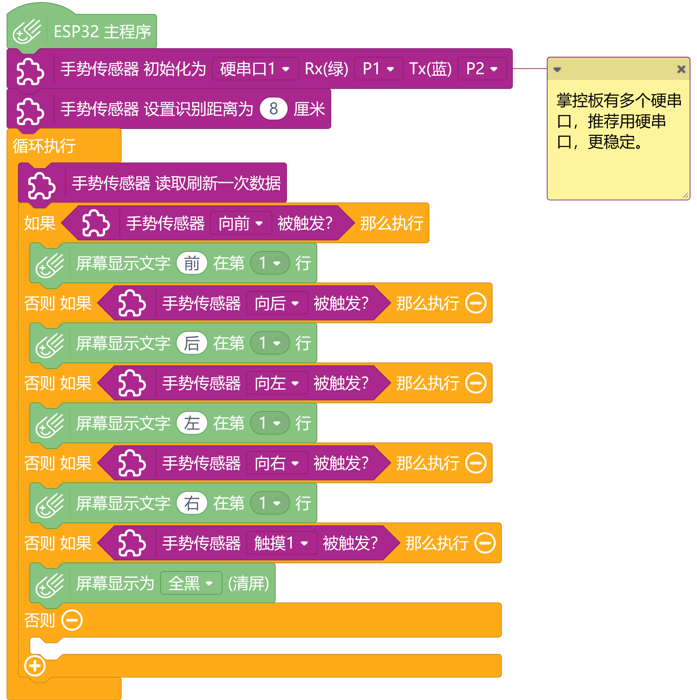

# Gesture & Touch Sensor 手势识别触摸传感器


---------------------------------------------------------


## 链接
- **本用户库加载地址:** ```https://github.com/liliang9693/ext-DFRobot_GestureTouchSensor```
- **Mind+下载地址：**```http://mindplus.cc```

## 简介
- **产品链接：** ```https://www.dfrobot.com.cn/goods-1994.html```  
- **介绍：** 本扩展库为DFRobot手势识别带触摸传感器（SEN0285）设计，支持Mind+导入库。

## Blocks


## 示例



## License

MIT

## 硬件支持

MCU                | JavaScript    | Arduino   | MicroPython    | Remarks
------------------ | :----------: | :----------: | :---------: | -----
micro:bit        |             |       √       |             | 
mpython        |             |        √      |             | 
arduino uno    |             |        √      |             | 

## 鸣谢
感谢**张玉华**老师提供测试配合。  

## 更新日志
- V0.1.0 20200126 第一版发布
- V0.1.1 20200127 对硬串口增加board参数屏蔽microbit中得硬串口初始化block
- V0.1.2 20200128 修复arduion uno板上使用硬串口初始化编译出错的bug

